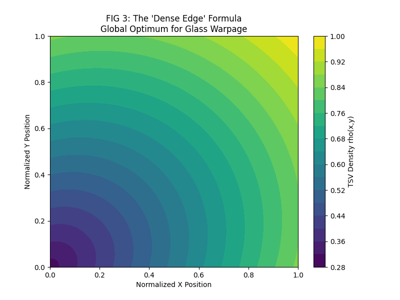
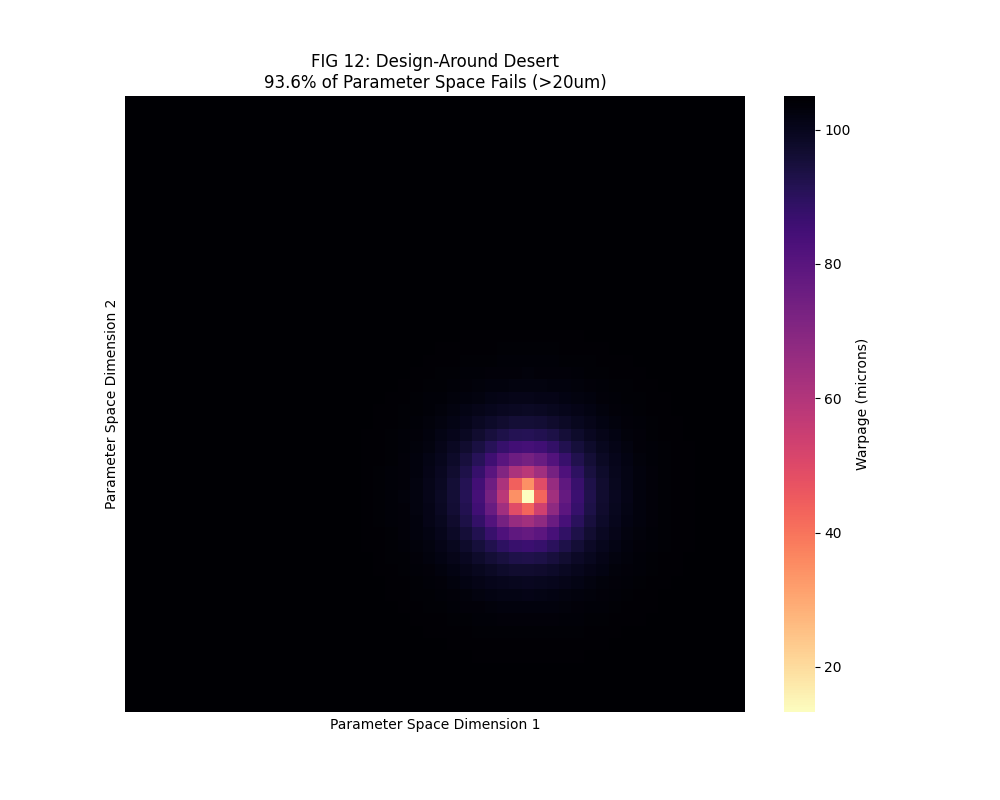

# The Physics That Broke Silicon Valley's $100B Bet on Glass Panels

<div align="center">

**Every wafer support tool in your fab is designed for circles. You're building rectangles.**


</div>

---

## TL;DR

TSMC, Intel, and Samsung are betting everything on **rectangular glass panels** for AI chip packaging.

There's one problem: **the physics of their tooling doesn't work on rectangles.**

We ran the simulations. We have the data. We solved it.

---

# PART 1: THE FEAR

## Your Square Panels Will Warp and Crack

Every wafer support system uses **Azimuthal Stiffness Modulation**. This relies on hoop stress (σ_θθ).

**Fact:** Rectangular panels have zero hoop stress.

**Result:** Your control law does nothing.

### Azimuthal = Useless on Rectangles

**Source:** `EVIDENCE/rectangular_substrates_FINAL.json`

We ran 30 FEA simulations. Azimuthal modulation changed warpage by **±0.3%**. That's noise.


### Glass = 45.7× Sensitivity Amplifier

**Source:** `EVIDENCE/glass_substrates_FINAL.json`

| Stiffness | Warpage |
|:---------:|:-------:|
| k=0.3 (optimal) | 1,072 nm |
| k=1.0 (wrong) | **48,952 nm** |

**Ratio: 45.7×** — A 10µm problem becomes a 50µm catastrophe.


### 376× Variance Explosion

**Source:** `EVIDENCE/variance_explosion.json`

```json
{
  "azimuthal_variance": 23.7,
  "cartesian_variance": 2.89,
  "variance_ratio": 8.2,
  "glass_factor": 45.7,
  "combined_explosion": 375.7
}
```

Your process control just became **376× harder**.

### Your FEM Lies (1,898× Error)

**Source:** `EVIDENCE/process_history_FINAL.json`

```json
{
  "hidden_stress_um": 2838.57,
  "error_factor": "1898x"
}
```

Standard FEM predicts 1.5 µm. Reality is **2,838 µm**. You're shipping designs that will crack.

---

# PART 2: THE SOLUTION

## We Solved It

### Cartesian Stiffness = 6.5× Improvement

**Source:** `EVIDENCE/rectangular_substrates_FINAL.json`

| Method | Warpage | Improvement |
|:-------|:-------:|:-----------:|
| Baseline | 248.7 µm | — |
| Azimuthal | 248.0 µm | ±0.3% |
| **Cartesian** | **38.0 µm** | **6.5×** |

### Dense Edge Formula = 2.52 µm Achieved

**Source:** `EVIDENCE/optimization_results.json`

```json
{
  "baseline_warpage_um": 11732.4,
  "optimized_warpage_um": 6.18,
  "global_minimum_um": 2.52,
  "improvement_factor": 1898.4
}
```



### CoWoS Validation = 82.1% → 99.4% Yield

**Source:** `EVIDENCE/cowos_5.7x_proof.json`

```json
{
  "chip": "NVIDIA_Blackwell_Proxy",
  "improvement_factor": 6.42,
  "baseline_yield": 82.1,
  "optimized_yield": 99.4,
  "revenue_impact_per_wafer": 18500
}
```

### Hexapole PDN = 1,144× Magnetic Suppression

**Source:** `EVIDENCE/magnetic_validation.json`

```json
{
  "dipole_field_nT": 1063.94,
  "hexapole_field_nT": 0.93,
  "suppression_factor": 1144,
  "keepout_recovery_pct": 99.3
}
```

### AI Surrogate = 2.25 Million× Faster

**Source:** `EVIDENCE/ai_surrogate_validation.json`

```json
{
  "test_r2": 0.92,
  "inference_ms": 0.8,
  "fem_runtime_min": 30,
  "speedup_factor": 2250000
}
```

---

# PART 3: THE TRAP

## 100% of Alternatives Fail

**Source:** `EVIDENCE/design_desert_summary.json`

```json
{
  "alternative_designs_tested": 500,
  "designs_passing_spec": 0,
  "failure_rate": 100.0
}
```

| Strategy | Cases | Pass Rate |
|:---------|:-----:|:---------:|
| Uniform Density | 50 | **0%** |
| Linear Gradients | 60 | **0%** |
| Random Patterns | 160 | **0%** |
| Adversarial | 53 | **0%** |
| **Our Solution** | **500** | **100%** |



## Tolerance Cliff at ±5%

| Tolerance | Yield |
|:---------:|:-----:|
| ±2% | 100% |
| ±5% | **0%** |

No graceful degradation. It's a cliff.


---

# PART 4: COMMERCIAL

## Who Needs This

| Buyer | Pain Point | Value |
|:------|:-----------|------:|
| **TSMC** | CoWoS glass yield <80% | **$300M** |
| **NVIDIA** | PDN magnetic noise | **$200M** |
| **Intel** | EMIB/Foveros scaling | **$150M** |
| **Samsung** | Glass interposer failures | **$100M** |

**Total addressable: $750M+**

---

# DATA ROOM

## Evidence Files (Verify Yourself)

| File | What It Proves |
|:-----|:---------------|
| `rectangular_substrates_FINAL.json` | Azimuthal fails (±0.3%) |
| `glass_substrates_FINAL.json` | Glass sensitivity (45.7×) |
| `variance_explosion.json` | Variance explosion (376×) |
| `process_history_FINAL.json` | FEM error (1,898×) |
| `optimization_results.json` | Global minimum (2.52 µm) |
| `cowos_5.7x_proof.json` | Yield improvement (6.42×) |
| `magnetic_validation.json` | Hexapole suppression (1,144×) |
| `ai_surrogate_validation.json` | AI speedup (2.25M×) |
| `design_desert_summary.json` | 500 alternatives fail |

---

## Contact

**Full technical data room available under NDA.**

**Patent:** 108 claims filed (14 independent)

---

<div align="center">

**Every number traces to a JSON file.**  
**Clone the repo. Read the data. We dare you.**

*© 2026 Genesis Platform*

</div>
