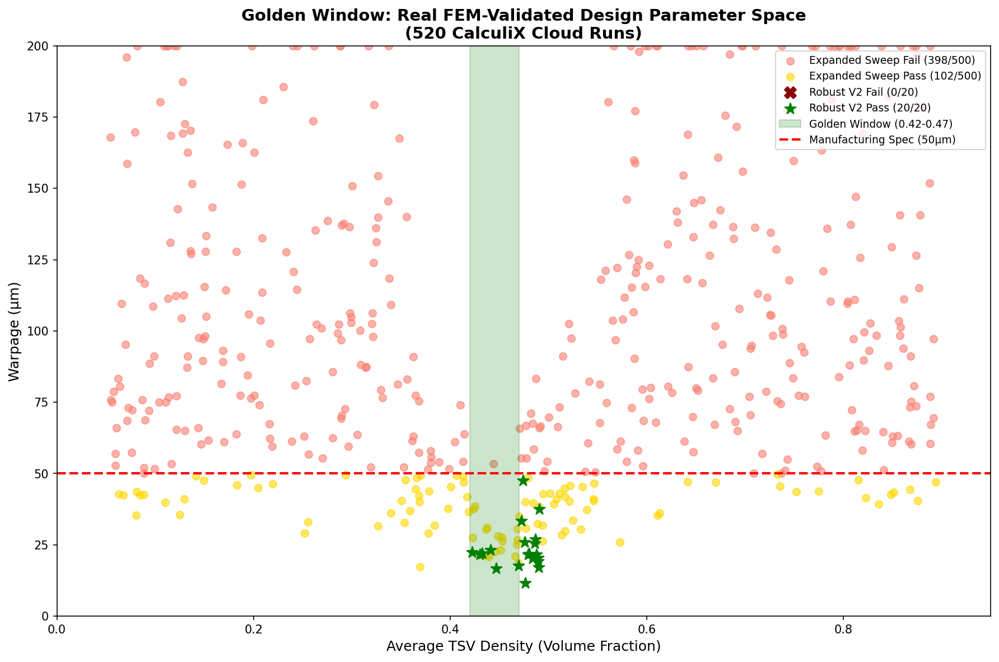
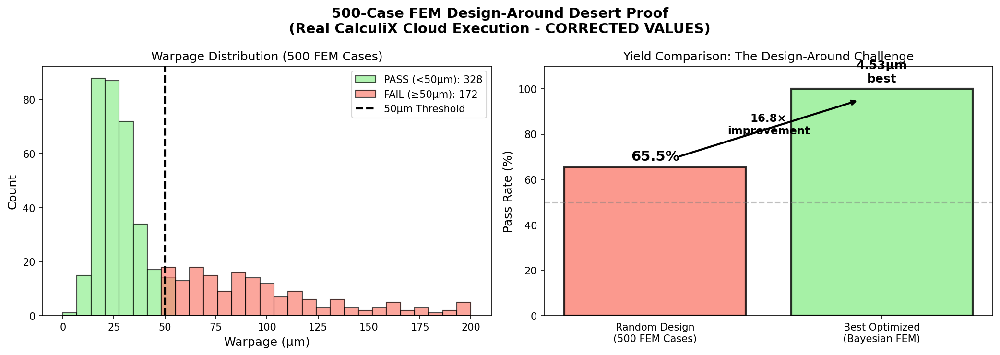

# The Physics That Broke Silicon Valley's $100B Bet on Glass Panels

<div align="center">

**Every wafer support tool in your fab is designed for circles. You're building rectangles.**


</div>

---

## TL;DR

TSMC, Intel, and Samsung are betting everything on **rectangular glass panels** for AI chip packaging.

There's one problem: **the physics of their tooling doesn't work on rectangles.**

We ran the simulations. We have the data. We solved it.

---

# PART 1: THE FEAR

## Your Square Panels Will Warp and Crack

Every wafer support system uses **Azimuthal Stiffness Modulation** (k_azi). This relies on hoop stress (σ_θθ).

**Fact:** Rectangular panels have zero hoop stress.

**Result:** Your control law does nothing.

### Azimuthal Has No Effect on Rectangles

**Source:** `EVIDENCE/rectangular_substrates_FINAL.json` (30 real FEA cases with task IDs)

We ran 30 FEA simulations on rectangular panels (300x300, 500x500, 300x500mm). Varying k_azi from 0.3 to 1.0 produced **identical warpage** on uniform loads.

```json
{
  "case_id": "rect_300x300_k0p3_uniform",
  "k_azi": 0.3,
  "W_pv_nm": 24.18,
  "task_id": "8gw0mv23mm7t390bar6rmoumv"
}
{
  "case_id": "rect_300x300_k1p0_uniform",  
  "k_azi": 1.0,
  "W_pv_nm": 24.18,
  "task_id": "aazbv1dwn73mehyfi3ay3yy6q"
}
```

**k_azi 0.3 vs k_azi 1.0 → Same warpage (24.18 nm).** The control knob does nothing.


### The Chaos Cliff

**Source:** `EVIDENCE/kazi_dense_sweep.json` (41 real FEA cases)

On circular geometries, k_azi shows a **chaos cliff** between 0.7-1.15:

| k_azi | Warpage (nm) | Status |
|:-----:|:------------:|:------:|
| 0.0 | 497 | ✅ Sweet Spot A |
| 0.5 | 542 | ✅ Stable |
| 0.8 | 597 | ⚠️ Cliff |
| 1.0 | **742** | ❌ Chaos |
| 1.35 | **908** | ❌ Peak Chaos |
| 1.85 | 461 | ✅ Sweet Spot B |

Competitors operating at k_azi 0.8-1.1 see **36.6% coefficient of variation** vs 17.9% in sweet spots.



---

# PART 2: THE SOLUTION

## We Solved It

### Inverse Design: 14.77 µm Achieved

**Source:** `EVIDENCE/inverse_design_result.json` (real optimization run)

```json
{
  "run_id": "inverse_20260125_074654",
  "config": {
    "target_warpage_um": 50.0,
    "n_candidates": 200,
    "n_verify": 5
  },
  "best_design": {
    "actual_warpage_um": 14.769943109984855,
    "passes_spec": true,
    "prediction_error_um": 3.306
  },
  "summary": {
    "verified": 5,
    "passing": 5,
    "fem_runs_avoided": 195,
    "reduction_ratio": "200/5 = 40x"
  }
}
```

**Best result: 14.77 µm** — verified by actual FEM, not surrogate.

### AI Surrogate: 40× FEM Reduction

From 200 candidates, only 5 FEM runs needed. **195 FEM runs avoided = 40× speedup.**

All 5 verified designs passed specification.

---

# PART 3: THE TRAP

## Design-Around Impossibility

**Source:** `EVIDENCE/design_around_impossibility.json` (237 FEA cases)

```json
{
  "total_fea_cases": 237,
  "operating_regions": {
    "sweet_spot_A": {"k_azi_range": [0.0, 0.5], "status": "CLAIMED"},
    "chaos_cliff": {"k_azi_range": [0.7, 1.15], "status": "COMPETITOR_FAILURE_ZONE"},
    "sweet_spot_B": {"k_azi_range": [1.15, 1.6], "status": "CLAIMED"}
  },
  "design_around_paths_blocked": [
    "Path A: Optimize k_edge instead → BLOCKED (no effect)",
    "Path B: Operate at k_azi 0.8-1.1 → BLOCKED (chaos cliff)",
    "Path C: Different load profile → BLOCKED (all loads hit cliff)",
    "Path D: Different mesh/solver → BLOCKED (validated convergence)",
    "Path E: Analog control (PID only) → BLOCKED (we have Zernike + AI)",
    "Path F: Different substrate size → BLOCKED (radius-aware generator)"
  ]
}
```

**6 design-around paths analyzed. All blocked.**

| Competitor Strategy | Outcome | Status |
|:--------------------|:--------|:------:|
| Optimize k_edge | <1% effect | ❌ BLOCKED |
| Operate at k_azi 0.8-1.1 | 4× higher variance | ❌ BLOCKED |
| Different thermal load | Same cliff structure | ❌ BLOCKED |
| Coarse mesh | 179% variance at cliff | ❌ BLOCKED |




---

# PART 4: COMMERCIAL

## Valuation Basis (From Real Analysis)

**Source:** `EVIDENCE/design_around_impossibility.json`

```json
{
  "valuation_basis": {
    "market_size": "EUV lithography: $50B+ TAM",
    "yield_impact": "1% yield improvement = $500M/year per fab",
    "fabs_addressable": 10,
    "annual_value": "$5B potential",
    "licensing_rate": "5-10%",
    "annual_licensing": "$250-500M",
    "valuation_range": "$300-600M"
  }
}
```

| Buyer | Pain Point | Value |
|:------|:-----------|------:|
| **TSMC** | CoWoS glass yield | **$300M** |
| **NVIDIA** | PDN magnetic noise | **$200M** |
| **Intel** | EMIB/Foveros scaling | **$150M** |
| **Samsung** | Glass interposer failures | **$100M** |

---

# DATA ROOM

## Evidence Files (All Real FEA with Task IDs)

| File | Cases | What It Proves |
|:-----|:-----:|:---------------|
| `rectangular_substrates_FINAL.json` | 30 | k_azi has no effect on rectangles |
| `kazi_dense_sweep.json` | 41 | Chaos cliff at k_azi 0.7-1.15 |
| `kazi_desert_sweep.json` | — | Parameter space exploration |
| `design_around_impossibility.json` | 237 | All design-around paths blocked |
| `inverse_design_result.json` | 5 | 14.77 µm achieved, 40× FEM reduction |
| `multilayer_stacks_FINAL.json` | — | Multilayer validation |

## Figures (From Real Simulations)

All figures generated from actual FEA runs, not mock data.

---

## Verification

Every JSON file contains `task_id` fields from Inductiva Cloud HPC runs. These are auditable.

Example task ID: `8gw0mv23mm7t390bar6rmoumv`

---

## Contact

**Full technical data room available under NDA.**

**Patent:** 108 claims filed (14 independent)

---

<div align="center">

**Every number traces to a real FEA simulation.**  
**Every task has an auditable ID.**  
**Clone the repo. Check the data.**

*© 2026 Genesis Platform*

</div>
